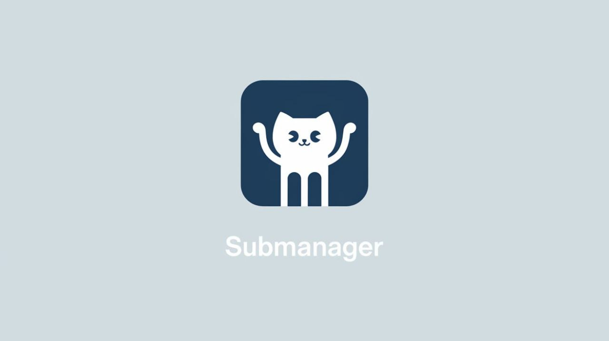

<h1 align="center">Подписывайся на тех, кто подписался на тебя!</h1>

<h2 align="center">Описание проекта</h2>

SubManager — это мощный и удобный инструмент на Python, предназначенный для автоматизации управления подписками в социальных сетях. В современном мире, где взаимодействие с аудиторией играет ключевую роль, важно поддерживать актуальность ваших подписок и быть в курсе изменений в вашей сети контактов.

С помощью SubManager вы можете легко подписываться на пользователей, которые подписались на вас, и отписываться от тех, кто решил от вас уйти. Это значительно упрощает процесс поддержания актуального списка подписок и позволяет вам сосредоточиться на взаимодействии с вашей аудиторией, а не на рутинных задачах.

Основные функции SubManager включают:

<ul>
    <li><strong>Кроссплатформенность:</strong> Скрипт написан на Python и работает на различных операционных системах, включая Windows, macOS и Linux, что делает его доступным для широкой аудитории.</li>
    <li><strong>Автоматическая подписка:</strong> Скрипт автоматически подписывается на всех пользователей, которые подписались на ваш аккаунт, что позволяет вам не пропускать новых подписчиков.</li>
    <li><strong>Автоматическая отписка:</strong> Вы можете легко отписываться от пользователей, которые отписались от вас, что помогает поддерживать чистоту вашего списка подписок.</li>
    <li><strong>Исключения для алгоритма:</strong> SubManager предоставляет возможность использовать два файла: <code>ban_list_followers.txt</code> и <code>ban_list_following.txt</code>. Эти файлы позволяют вам добавлять пользователей в черный список, исключая их из автоматических подписок и отписок, что дает вам полный контроль над тем, кого вы хотите оставить вне автоматизированного процесса.</li>
</ul>
<h2 align="center">Установка</h2>
<ol>
    <li><strong>Клонируйте репозиторий:</strong>
        <pre><code>git clone https://github.com/yourusername/SubManager.git
cd SubManager</code></pre>
    </li>
    <li><strong>Настройте файл <code>main.py</code>:</strong>
        
Откройте файл <code>main.py</code> и измените следующие поля на свои:

        <pre><code>USERNAME = 'YOUR_USERNAME'
TOKEN = 'YOUR_ACCESS_TOKEN'
GLOBAL_PATH = "YOUR_GLOBAL_PATH"
</code></pre>
    </li>
</ol>

<h2 align="center">Запуск программы</h2>

Чтобы запустить программу вручную, выполните следующую команду в терминале:

<pre><code>python3 main.py</code></pre>

<h2 align="center">Автоматизация запуска</h2>

Чтобы автоматизировать запуск скрипта SubManager, выполните следующие шаги в зависимости от вашей операционной системы:

<h3>Для Linux</h3>
<ol>
    <li>Откройте crontab для редактирования:
        <pre><code>sudo crontab -e</code></pre>
    </li>
    <li>Добавьте следующую строку в файл crontab:
        <pre><code>0 */2 * * * /usr/bin/python3 GLOBAL_PATH/main.py</code></pre>
        
Замените <code>GLOBAL_PATH</code> на полный путь до файла <code>main.py</code>.

    </li>
    <li>Сохраните изменения и выйдите из редактора.</li>
</ol>

<h3>Для Windows</h3>
<ol>
    <li><strong>Откройте Планировщик задач:</strong>
        <ul>
            <li>Нажмите <strong>Windows + R</strong>, введите <code>taskschd.msc</code> и нажмите Enter.</li>
        </ul>
    </li>
    <li><strong>Создайте новую задачу:</strong>
        <ul>
            <li>В правой панели выберите <strong>Создать задачу</strong> (<em>Create Task</em>).</li>
        </ul>
    </li>
    <li><strong>Настройте общие параметры:</strong>
        <ul>
            <li>Введите имя задачи и описание.</li>
            <li>Убедитесь, что выбрана правильная версия Windows в поле <strong>Конфигурация для</strong> (<em>Configure for</em>).</li>
        </ul>
    </li>
    <li><strong>Настройте триггер:</strong>
        <ul>
            <li>Перейдите на вкладку <strong>Триггеры</strong> (<em>Triggers</em>) и нажмите <strong>Создать</strong> (<em>New</em>). </li>
            <li>Выберите <strong>По расписанию</strong> (<em>On a schedule</em>). </li>
            <li>Установите частоту на <strong>Каждые 2 часа</strong>. Для этого можно выбрать "Ежедневно" и затем указать интервал выполнения.</li>
        </ul>
    </li>
    <li><strong>Настройте действие:</strong>
        <ul>
            <li>Перейдите на вкладку <strong>Действия</strong> (<em>Actions</em>) и нажмите <strong>Создать</strong> (<em>New</em>). </li>
            <li><strong>Выберите Запустить программу</strong> (<em>Start a program</em>). </li>
            <li>
<strong>В поле "Программа или сценарий"</strong>, укажите путь к интерпретатору Python, например:

                <pre><code>C:\Path\To\Python\python.exe</code></pre></li>
            <li>
<strong>В поле "Аргументы"</strong>, укажите путь к вашему скрипту:

                <pre><code>C:\Path\To\Your\Script\main.py</code></pre></li>
        </ul>
    </li>
    <li><strong>Сохраните задачу:</strong>
        <ul>
            <li>
Нажмите "ОК", чтобы сохранить настройки задачи.
</li>
        </ul>
    </li>
</ol>

<h3>Для macOS</h3>
<ol>
    <li>Откройте терминал.</li>
    <li>Введите команду для редактирования crontab:
        <pre><code>crontab -e</code></pre>
    </li>
    <li>Добавьте следующую строку в файл crontab:
        <pre><code>0 */2 * * * /usr/local/bin/python3 GLOBAL_PATH/main.py</code></pre>
        
Замените <code>GLOBAL_PATH</code> на полный путь до файла <code>main.py</code>.

    </li>
    <li>Сохраните изменения и выйдите из редактора.</li>
</ol>

<h2 align="center">Лицензия</h2>

Этот проект лицензирован под <a href="LICENSE">MIT License</a>. MIT License — это одна из самых популярных и простых лицензий с открытым исходным кодом. Она позволяет:

<ul>
    <li><strong>Использовать:</strong> Вы можете использовать код проекта в своих собственных проектах, как личных, так и коммерческих.</li>
    <li><strong>Изменять:</strong> Вы можете изменять код проекта, адаптируя его под свои нужды или улучшая функциональность.</li>
    <li><strong>Распространять:</strong> Вы можете распространять оригинальный код или свои модификации, при этом необходимо указать авторство оригинального проекта.</li>
</ul>

Важно отметить, что лицензия не предоставляет никаких гарантий, и авторы не несут ответственности за возможные проблемы, возникающие при использовании кода.

<h2 align="center">Контакты</h2>

Если у вас есть вопросы, предложения или вы хотите обсудить проект, пожалуйста, свяжитесь со мной через Telegram: <a href="https://t.me/K1rsN7">@K1rsN7</a>.

Я всегда рад услышать отзывы и предложения по улучшению проекта. Ваша поддержка и идеи помогут сделать SubManager еще лучше!

